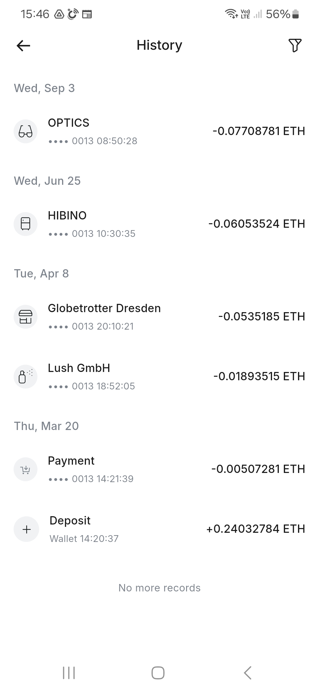

# redot2koinly

Convert Redotpay transaction-history screenshots into a Koinly simple transaction CSV.

*January 2025 Status: Built and used on a Mac computer. Tested with screenshots from one Android phone. Your experience may vary. Feedback is welcomed.*

Usage (basic, see detailed instructions below):

```bash
# Clone the repository
git clone https://github.com/Bluetegu/redot2koinly
cd redot2koinly

# Create virtual environment
python3 -m venv .venv
source .venv/bin/activate  # On Windows: .venv\Scripts\activate
pip install -e .

# Place screenshots in the data sub-directory

# Run the conversion program (adjust --year and --timezone as needed)
redot2koinly

# Review the generated redotpay.csv file
# Compare against your transaction history, add missing screenshots,
# and remove any incorrectly parsed transactions

```

## Disclaimer

**USE AT YOUR OWN RISK.** This software is provided "AS IS" without warranty of any kind. The user assumes all responsibility and liability for the accuracy of the OCR parsing, transaction data conversion, and financial record-keeping. 

**Important:**
- Always verify the generated CSV against your original transaction history
- This tool uses OCR which can misread text or miss transactions
- Double-check all amounts, dates, and merchant names before importing to Koinly
- The author disclaims all liability for any financial losses, incorrect tax calculations, or other damages arising from use of this software

**By using this software, you acknowledge that you are solely responsible for:**
- Validating the accuracy of all converted transaction data
- Ensuring compliance with your tax obligations
- Any consequences resulting from inaccurate or incomplete data

## Detailed instructions

### Taking screenshots

**Accessing Transaction History:**
  - The transaction history is kept in Redotpay per Asset. Click the Assets icon on the bottom right, and select one of the assets (e.g. Ethereum). The asset screen includes a History log of the latest transactions. Click on the three dots '...' to the right of the 'History' title to reach the full transaction history log. An example of such a (short) transaction history is given below:

<div align="center">
  
</div>

**Screenshot Process:**
1. Take screenshots of the history log. Scroll down and capture all relevant log pages.
2. The converter automatically removes duplicate transactions that appear in multiple screenshots.
3. Repeat for all relevant assets.

**Important Considerations:**
- **File formats:** Supported file extensions are .jpg, .jpeg, and .png
- **Date filtering:** Avoid irrelevant transactions (e.g. 2026 transactions if building a 2025 report). Since Redotpay history dates don't include years, the converter uses the configured year (default: 2025) to complete the date. If it's not possible to avoid irrelevant transactions, remember to remove them from the output CSV file.
- **Date visibility:** The history log includes a date followed by one or more transaction records. Take screenshots where the date appears at the top.
- **Image quality:** Transfer screenshots to your computer preferably without decreasing resolution. Transferring via WhatsApp, for example, decreases resolution by default. The converter does work with such images, but expect a higher likelihood of OCR errors.

### Running the converter

**Optional Parameters:**
- `--input` (`-i`): Input image file or directory (default: `data`)
- `--output` (`-o`): Output CSV filename (default: `redotpay.csv`)
- `--config` (`-c`): Path to JSON config file
- `--timezone` (`-z`): Timezone of screenshots (default: `Asia/Jerusalem`)
- `--year` (`-y`): Transaction year for dates (default: `2025`)
- `--verbose` (`-v`): Enable verbose logging
- `--print-logs`: Print log messages to screen
- `--version`: Show program version

Run `redot2koinly -h` for complete usage information.

**Incremental Processing:**
- The converter supports incremental execution on the same output CSV. The tool reads existing rows, appends new rows, deduplicates by `(Koinly Date, Amount, Currency, Label)`, sorts by `Koinly Date` (empty dates last), and rewrites the file with a single header.

Example:
```bash
# First run
redot2koinly --input data --output redotpay.csv
# Add more screenshots into data/, then run again (same output file)
redot2koinly --input data --output redotpay.csv
```

### Converter output

**Output CSV Collumn Format:**
  - **Koinly Date:** UTC timestamp composed of date/time from screenshot plus configured timezone and year
  - **Amount:** Transaction amount read from screenshot
  - **Currency:** Currency code read from screenshot  
  - **Label:** Merchant name read from screenshot, normalized and capitalized. Non-alphanumeric characters are removed from the beginning (e.g., "!@#STORE" → "STORE"). If the merchant name ends with a non-alphanumeric character, that character and the last alphanumeric character are removed, and three dots (...) are added instead. This normalization avoids OCR misreads that lead to deduplication failures. For example, if the merchant name is truncated, the Redotpay application adds '...' after the truncated name, and OCR may confuse 'I.' with 'L'.
  - **TxHash:** Left empty


**Converter Output Statistics:**

```
(.venv) (base) ronc@MacBookPro redotpay % redot2koinly       
Processing WhatsApp Image 2026-01-13 at 19.14.38.jpeg
Using CPU. Note: This module is much faster with a GPU.
Processed 1 files (ignored: 0) in 7.53s
Records read: 7, written: 7, duplicates: 0, errors: 0
```
The above is an example screen output. The output includes:

  - Files being processed
  - Total files processed during the run
  - Total number of files ignored (OCR looks for 'History' in the screenshot header; files without this text are ignored)
  - Total records read from screenshots
  - Total new records written to the CSV file
  - Total duplicate records not written (duplicates already exist in the output CSV)
  - Number of error records that were read but marked as invalid (these are not written to the output CSV file)


```
(.venv) (base) ronc@MacBookPro redotpay % redot2koinly       
Using CPU. Note: This module is much faster with a GPU.
Processing Screenshot_20260105_142207.jpg
Processing Screenshot_20260105_142220.jpg

.... Additional 33 files being processed

Processed 35 files (ignored: 0) in 275.13s
Records read: 247, written: 181, duplicates: 58, errors: 8

Files with errors:

data/Screenshot_20260105_142241.jpg:
  HATZI HINAM - Missing time (Fri, Dec 12 -0.00386572 BTC)

... Additional 7 errors

(.venv) (base) ronc@MacBookPro redotpay % 
```
The above is a (truncated) example screen output with errors. The errors include the error reason (Missing time) and additional parameters which allow easy identification of the record (file name, merchant name and other identifiable record items). The errors do not necessarily imply that something is wrong. In the example above the last record in the screenshot was truncated, and hence the OCR did not find its time. Another screenshot may or may not include this record already.

### Verifying output

- Review all errors. Take additional screenshots if the record was not read already from a different screenshot.
- Compare the CSV output and the history log, and identify missing or superfluous records. The amount and currency are usually read correctly, but double checking is encouraged. Add additional screenshots that include the missing records. Remove superfluous records as they are usually created as a result of OCR misreads (this should be rare).

### Reporting errors

- Please submit errors and feature requests through GitHub issues.
- The log file (by default redot2koinly.log) includes detailed information including OCR detection results.

## Development

### Running Tests

```bash
# Install with dev dependencies
pip install -e ".[dev]"

# Run all tests
pytest

# Run specific test
pytest tests/test_regression_eth.py

# Run regression tests via script
scripts/run_regression.sh
```

### Test Coverage
- Single file tests: `test_regression_eth.py`, `test_regression_error1.py`, `test_regression_error2.py`
- Multi-file test: `test_regression_data_dir.py` (validates directory input)
- End-to-end test: `test_end_to_end.py`
- Incremental runs test: `test_incremental_runs.py`
